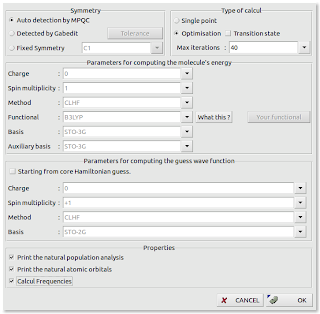
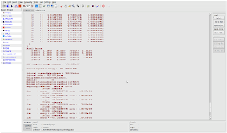
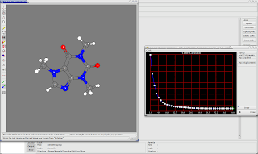
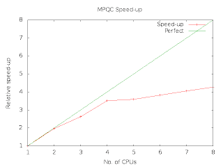

## Free chemistry software - quantum chemistry

In the previous part of the journey into free chemistry software I wrote about molecular mechanics. The molecular mechanics view of a molecular system is a classical mechanical view i.e., the atoms move according to Newton's law.

Quantum mechanics revolutionized the view of the atomic world. The [Schrödinger equation](http://en.wikipedia.org/wiki/Schrödinger_equation) is a general model and number of parameters is limited. Solving a Schrödinger equation for an atomic or molecular system is often referred to an ab initio calculation. The word *ab initio* is latin and can be translated to *from the beginning* or *from first principles*.

The Schrödinger equation - in particular the time-independent equation - can be used to calculate many different properties of chemical substances. Properties like enthalpy and entropy, and heat capacity can calculated as the partition function can be calculated from the solution. Moreover, it is possible to predict data for various spectra (IR, Raman, UV-VIS, etc.). The problem is that it is not possible to find an analytical solution for any non-trivial cases. The solutions to the equation are called wave functions. The [Copenhagen interpretation](http://en.wikipedia.org/wiki/Copenhagen_interpretation) of quantum mechanics is that the wave function represents the probably distribution (in space) of the electron.

In order to solve the (time independent) Schrödinger equation you must make two important approximations. The first approximation is that the nucleus of the atom is fixed in space, and the Schrödinger equation is reduced to only model the electrons. This approximation is called the [Born-Oppenheimer approximation](http://en.wikipedia.org/wiki/Born-Oppenheimer_approximation). The rationale behind the approximation is that the nucleus of an atom is much heavier that the electrons, and the nucleus moves much slower (this is probably a classical mechanical picture). The second approximation is that the wave function is a sum - or linear combination - of other functions. These functions form a basis set. The basis set is often atom orbitals (solution to the Schrödinger equation for a single atom), and they are often selected in much a manner that they require so few CPU cycles to process as possible. A popular family of basis set is the [Slater-type orbitals](http://en.wikipedia.org/wiki/STO-nG_basis_sets).

There are many quantum chemistry packages in the world. From a license perspective, they fall in three groups. The first group is completely proprietary software. You buy the package (maybe the source code is included so you can compile it yourself) and can use it for the set of computers, you have bought a license for. It is not rare to find special pricing schemes for users in the academic world. [Gaussian](http://www.gaussian.com/) is a leading software vendor in this field, and a site license (with UNIX source code) for commercial use is listed as roughly 40,000 USD. This might sound like a high price tag but you must remember that the development of a new drug can easily run in billions. Compared to that, the software is quite cheap - if you are in [big pharma](http://en.wikipedia.org/wiki/Big_pharma). Gaussian does provided must more that just a quantum chemistry calculation engine - it includes various supporting utilities. The group of free software packages is another group with a completely different licensing model. A typical example is [MPQC](http://www.mpqc.org/) (Massive Parallel Quantum Chemistry). Released under GNU General Public License it is a truly free software package. The motivation of the developers is to test new algorithm - in particular for the parallellization for using either compute clusters or multicore computers. Somewhere in between you find the third group. Software packages in this group are free to download (if you are in academia or using it for personal purposes) but you are allowed to redistribute the source code or binary. And often you must include a citation to a particular scientific paper if you publish any results based on the software. In this group you find packages like GAMESS (both US and UK versions). 

### Gabedit

The program [gabedit](http://gabedit.sourceforge.net/) provides a uniform interface to many quantum chemistry packages including GAMESS-US, GAMESS-UK, Gaussian and MPQC. The program exists as a binary package for most Linux distributions including Ubuntu Linux and Debian GNU/Linux which makes the installation quite simple.

[1,3,7-trimethylxanthine](http://pubchem.ncbi.nlm.nih.gov/summary/summary.cgi?cid=2519&loc=ec_rcs) is a known (legal) psycho-active chemical. It is found naturally in coffee, tea, and soft drinks. The trivial (non systematic) name is [cafferine](http://en.wikipedia.org/wiki/Caffeine). It is a small molecule with an aromatic ring structure.

You can either draw your molecule or load a file. The structure of many molecules can be found at PubChem or similar services. A 3-dimensional structure of Cafferine can be found at [PubChem](http://pubchem.ncbi.nlm.nih.gov/). A 3-dimensional structure is nothing more that the coordinates of the nuclei of the atoms in the molecule. Using OpenBabel (discussed in previous blog entries), you can convert the PubChem files format to something that Gabedit can understand.

Setting up a calculation is simple but you are required to know and understand all the parameters and methods. For a causal user of quantum chemistry software, Gabedit might help you to allow to write configuration files manually, but the program is a thin wrapper only.

Once you have edited the calculation parameters, you are ready to go. It is possible to monitor the progress of your simulation but beware that quantum chemistry calculation might take hours. Gabedit will use the good old UNIX trick called `nohup` so you can come back later. Moreover, Gabedit let you perform the calculation on remote machines. This is useful for long calculations.

When the calculation has finished, Gabedit can assist you in analyzing the result. It is only a limited number of analyses offered, and if you need more advanced analysis, you will probably write small scripts and programs to help you.

The really good thing about Gabedit is that it provides a uniform interface to the most common quantum chemistry packages.

Other software packages exists e.g., [Ghemical](http://bioinformatics.org/ghemical/ghemical/index.html). Ghemical is fairly tight bound to GNOME, and tries to solve all needs for computational chemistry in one packages. The latest version of Ghemical is recent (October 2011).

### MPQC

[MPQC](http://www.mpqc.org/) is a pure free software project which provides an ab initio package. It is designed to run in multicore or cluster environments i.e., in massive parallel environment. Ubuntu and Debian packages exists. Currently, two packages exist: the core program and supporting utilities. Even an Emacs mode can be found for editing the configuration files. The main mode of operation is that the user writes a configuration or input file and run the program from the command-line or through a [batch system](http://en.wikipedia.org/wiki/Batch-queuing_system). The OpenBabel conversion utility supports MPQC and can write raw input files from structure file formats. This simplifies the usage a lot in the learning period.

In order to test MPQC, I have prepared an input file using Caffeine. As MPQC supports the calculation of thermodynamics properties (non-electronic enthalpy and entropy), my test input file will perform this analysis after the [geometry optimization](http://en.wikipedia.org/wiki/Geometry_optimization) using the STO-6G basis set and a Hartree-Fock method. The [Hartree-Fock method](http://en.wikipedia.org/wiki/Hartree–Fock_method) is only calculating the ground level state, and the thermodynamics will be somewhat inaccurate.

As MPQC is a parallel calculation program, it is worth analyzing the speed-up i.e., how well does scale as the number of core/CPUs increases. MPQC is parallellized using either [MPI](http://www.open-mpi.org/), SysV shared memory and Posix threads.

Running on multiple cores is simple with MPQC. You can specify the number of threads on the command-line. For a 4-thread calculation, the command-line is: `mpqc -threadgrp "<PthreadThreadGrp>:(num_threads = 4) -o caffeine.out caffeine.in` where `caffeine.in` is the input file and the output is found in caffeine.out.
As I have access to a hyperthreaded quad-core computer, I have tested the Posix thread parallelization (please remember that Linux has a highly optimized Posix thread implementation).

The result of my simple benchmark shows that hyperthreading is not a good idea in heavy computing environment - notice that the speed-up levels off at four cores. The reason is probably that the threads are competing for a limited resource: the floating-point units. A calculation of the Caffeine molecule took about 8 hours using 4 Posix threads, and this only calculated the ground state using the STO-6G basis set.

### Summary

In general it is possible to carry out quantum chemistry calculation using free software if you can live without a fancy user interface. If you do many calculations, you might be happy to know that you can modify and extend the source code. For a causal computational chemist (maybe an organic chemist predicting spectres), free chemistry software might not be the solution yet.