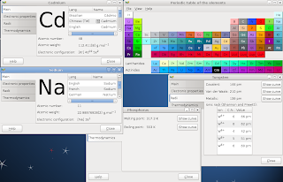
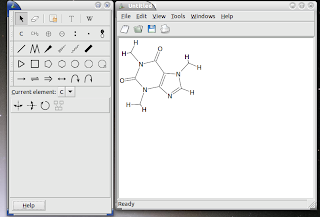

## Free Chemistry Software - Utilities

One of the major annoyances as chemists in front of computer is faced with is the vast number of file formats. The good news is that most file formats are text files so it is possible to reverse engineer them by looking at a number of examples. One open source project called [OpenBabel](http://www.openbabel.org/) tries to help chemists in converting between the formats (currently OpenBabel supports 113 file formats related to chemistry). Most Linux distributions have packages for OpenBabel, including Debian GNU/Linux (it's a version from 2009 you find in Debian stable). Converting a molecular structure of caffeine from one file format (SDF) to another (PDB) is simply done by the following command: `babel -isdf caffeine.sdf -opdb caffeine.pdb`

You can find many small molecules - with 3D structures, physical properties and toxicology data - at [PubChem](http://pubchem.ncbi.nlm.nih.gov/). For larger molecules (proteins mainly), you can go to the [Protein Data Bank](http://www.pdb.org/). The file for caffeine as used above can be found at PubChem.

OpenBabel project also includes a number of other utilities including a chemist's version of `grep` called `obgrep` (searching for molecules with a particular substructure within a database) and simple program to (energy) minimize a molecule called `obminimize`.

[GNOME Chemistry Utils](http://gchemutils.nongnu.org/) is a set of utilities developed for GNOME users. The set includes a calculator (for calculating the molecular mass of a molecule), the periodic table of the elements, and a spectrum viewer. The periodic table of the elements can give you the physical and chemical properties of all elements. Most chemists have a periodic table of elements close when working,
and having one on your desktop seems as a good idea.

Chemists do a lot of drawing: they draw structures of molecules. In can be regarded as a generic representation of a molecules 3-dimensional structure using a 2D paper. Understanding and drawing such chemical structures are an integral part of any chemist's education and chemists have used these drawing for more than 150 years (the discovery of the electron and the development of quantum mechanics changed the view of molecular structures). The 3-dimensional geometry is an important factor for determine the properties (reactivity, toxicology, color, etc.) of a molecule.

A drawing program for chemists is not hard to image. When it comes to free software, we are so lucky that we have more than one. GNOME users can use the molecular drawing program from the GNOME Chemistry Utils project. It is called `GChemPaint`. As GChemPaint can only load a rather small number of file formats, you really learn to use OpenBabel rather quickly. It is an easy program to work with, and it is possible to save your drawing in most used image formats (both bitmap and vector formats). You can then easily insert your drawing in your favorite word processing software prior to publication (take publication rather broad: everything from a high-school report to a paper in [Nature](http://www.nature.com/)).

As already said, drawing programs for chemists are not hard to imagine. Other projects in this area include titles likes bkchem, chemtool, easychem, xdrawchem, [jchempaint](http://cdk.sourceforge.net/), [molsKetch](http://molsketch.sourceforge.net/) (probably stalled).