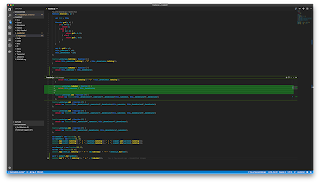
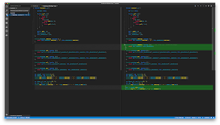
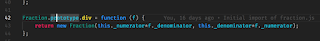
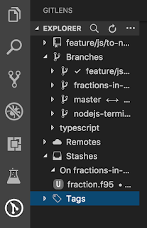

## Git and VSCode

[Visual Studio Code](https://code.visualstudio.com/) has since it first public release in 2015 increased fast in popularity. Being a cross-platform editor and released as open source software, many software developers have downloaded it. The fact that Microsoft is behind Visual Studio Code means that programming languages like TypeScript, C#, and C++ are well supported.

Git has become the de facto standard for version control systems. In particular Git providers like Gitlab, Bitbucket, and Github have made it easy for software developers to set up Git repositories. Many developers are using Git directly from the command-line, but there exist also a good portion of graphical Git clients. Today, any code editor and any integrated development environment (IDE) must have some kind of Git support.

### What is built-in?

Visual Studio Code has support for basic Git operations. This includes creating branches, checkout branches and pushing to and pull from remotes.

On the status line, you can see which branch you are on. By clicking on the branch name, a list of existing branches will appear, and you can easily checkout another branch. Another option is to create a new branch.

Right to the line numbers in the editor, you can see if you have change a line: a marker is shown. If you click on the marker, the diff will be shown. The inline diff is useful when you are working together with someone else on the same branch.

Once you are ready to commit your changes, you can click on the source code icon (default: third icon from the top) or use `SHIFT-CTRL-G`. You will see a list of all files you have changed or created. By clicking on a file in the list, the editor will split in two. You can now see the diff of the entire file. Clicking on the `+`-icon will add them to the commit. Type a message, and you have created a commit. 

### GitLens

[GitLens](https://gitlens.amod.io) is a great extension to help you understand your code base better. It is in particular useful if you work on large code bases with many contributors. One way to explain GitLens is to say it is Git blame on steroids.

Once installed and enabled, you can see when and who change a line. Knowing who did the latest change to a line or block makes it easy to ask for help - you simply know who to ask right away. Of course, it is not the same as you will get a useful answer but that’s another story.

GitLens also adds a new icon to the left menu. Clicking on the icon will open a Git explorer. You can now easily explore branches, tags, and stashes. Searching for old commits has never been easier.

### Github issues and pull requests

It is not a big secret - Microsoft has acquired Github. At the same time, Microsoft is the founding father of Visual Studio Code. Not surprisingly, Microsoft has developed a couple of extensions to make these two tools work better together.

First one to mention is [Github Issues](https://marketplace.visualstudio.com/items?itemName=ms-vscode.github-issues-prs) ([Github repository](https://github.com/Microsoft/vscode-github-issues-prs) - yes, Microsoft has open sourced the source code!). The extension adds an issue explorer, and you find it under the file explorer. It is a personal tool in the sense it will only know Github issues assigned to you. A click on an issue, and the issue will be opened in your web browser.

Another fine extension from Microsoft is [Github Pull Requests](https://marketplace.visualstudio.com/items?itemName=GitHub.vscode-pull-request-github). This extension adds an pull request explorer in the Git explorer so you can get to by `SHIFT-CTRL-G`. You can explore your pull requests; either the ones you have created or the ones which are assigned to you. Moreover, you can see the pull requests where you are asked for a review. Instead to doing the review in your browser, you can do it from within Visual Studio Code.

### Still a console cowboy

I have recently moved to Visual Studio Code, and I am not yet a complete fanboy. But many aspects of it are good, and I keep exploring it.

After many years as a Git user, I still have the habit of doing many Git operations directly on the command-line. Simply because it has been part of my workflow for such a long time.

I have only scratch the surface by looking at a couple of extensions. If you go to Visual Studio Code market, you will be amazed by the number of Git related extensions. 