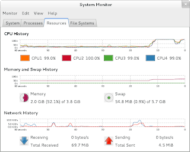

## Map/Reduce and GNU Parallel

This week I attended a meeting organized by [DKUUG](http://www.dkuug.dk/). The topic was [GNU Parallel](http://www.gnu.org/software/parallel/) and the speaker was [Ole Tange](http://ole.tange.dk/) - the developer behind GNU Parallel.

To be honest, I have not used GNU Parallel before. Of course, I have heard about it as Ole always talks about the program when I meet him. His introduction to the program was great - enjoy it when DKUUG releases the video.

Simply put, GNU Parallel is able to run tasks in parallel. It can either be running locally or remotely. In order words, GNU Parallel can help you to transform your command-line into a parallel computational engine.

Lately, I have been studying [Apache Hadoop](http://hadoop.apache.org/). Currently, Hadoop is probably the most popular implementation of the programming paradigm [Map/Reduce](http://en.wikipedia.org/wiki/Map/reduce). GNU Parallel offers a way of specifying the Map component. It is activated by using the `--pipe` option. On my way home I was thinking on how to implement a simply Map/Reduce based analysis using GNU Parallel.

I have used the [On Time Performance](http://www.transtats.bts.gov/Fields.asp?Table_ID=236) data set more than once. It is a good data set as it is highly regular and it is large (5-600,000 rows every month). The data set records every flight within USA, and you can find information about destination airport, delays, and 120 other data points. 6 months of data will result in a 1.3 GB (comma separated value) file.

A simple analysis of the data set is to generate a table of the number of time an airport is used by a flight. The three-letter airport code is unique e.g., LAX is Los Angeles International Airport. It is possible do the analysis in parallel by breaking the data file into smaller parts. This is the map task. Each task will produce a table, and the reduce task will combine the output for each map task into the final table.

In order to use GNU Parallel as driver for Map/Reduce, I have implemented the mapper and reduce in Perl. The mapper is:

```perl
#!/usr/bin/perl -w

use strict;

my %dests;
while (<>) {
    my @data = split /,/;
    my $airport = $data[14];
    $dests{$airport} = 0 if (not exists $dests{$airport});
    $dests{$airport}++
}

foreach my $airport (keys %dests) {
    printf "$airport $dests{$airport}\n";
}
```

The reducer is also simple:

```perl
#!/usr/bin/perl -w

use strict;

my %dests;
while (<>) {
    chomp;
    my ($airport, $count) = split / /;
    $dests{$airport} = 0 if (not exists $dests{$airport});
    $dests{$airport} += $count;
}

my $total = 0;
foreach my $airport (sort keys %dests) {
    $total += $dests{$airport};
    print "$airport $dests{$airport}\n";
}
print "Total: $total\n";
```

It is possible to run the Map/Reduce analysis by the command-line:

```sh
cat On_Time_Performance_1H2012.csv | parallel --pipe --blocksize 64M ./map.pl | ./reduce.pl
```

The input file is broken down into 64 MB chunks. GNU Parallel is line oriented so a chunk will not be exactly 64 MB but close. My laptop has four cores, and they are fully utilized.



It seems to me that GNU Parallel offers a simple approach to Map/Reduce for people living much of their life on a command-line.
