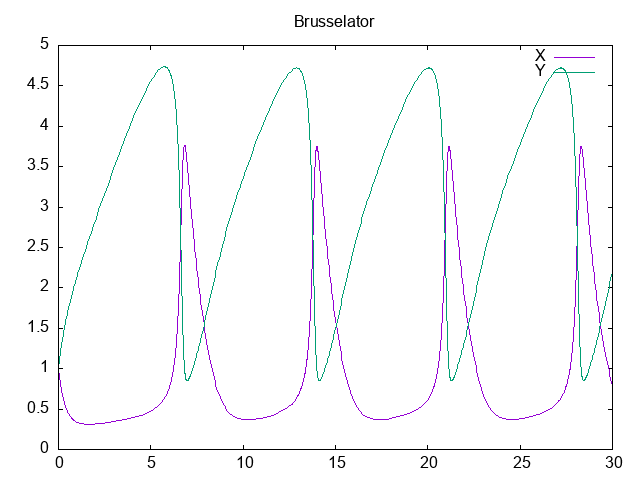

## Mathjs and the Brusselator

As a graduate student I implemented [kc](https://github.com/kneth/kc) to simulate oscillating chemical reactions, and in collaboration with Keld Nielsen, I implemented numerical methods to solve ordinary differential equations (ODEs).

The [Brusselator](https://en.wikipedia.org/wiki/Brusselator) is a fine example of an oscillating chemical reaction, and for most values of the parameters the behavior is pretty fine (meaning that you don't see very advanced numerical methods to solve it).

I recently noticed that functionality to [solve ODEs](https://github.com/josdejong/mathjs/pull/2958) has been added to [Mathjs](https://mathjs.org/). To me that is a major development, and it make Mathjs an interesting library to work with. In order to try out the new functionality, I have simulated the Brusselator in JavaScript (using node.js). My little script `brussel.js` is:

```js
const math = require("mathjs");

const A = 1;
const B = 3;

function brussel(t, c) {
  X = c[0];
  Y = c[1];

  dX = A + X*X*Y - B*X - X;
  dY = B*X - X*X*Y;
  return [dX, dY];
}

let sol = math.solveODE(brussel, [0, 30], [1.0, 1.0], { method: "RK23" });

let n = sol.t.length;
for(let i = 0; i < n; i++) {
  console.log(`${sol.t[i]}, ${sol.y[i][0]}, ${sol.y[i][1]}`);
}
```

The script outputs a CSV file to `stdout`, and I run the script as `node brussel.js > out`. To plot the data, I am using [GNUplot](http://www.gnuplot.info). My GNUplot script is very simple:

```
set terminal 'png'
set output 'brussel.png'

set title 'Brusselator'
plot 'out' using 1:2 title 'X' with lines, 'out' using 1:3 title 'Y' with lines
```



I hope that Mathjs will add more advanced ODE solvers in the future - in particular methods which can solve [stiff equations](https://en.wikipedia.org/wiki/Stiff_equation) since many chemical reactions are stiff.